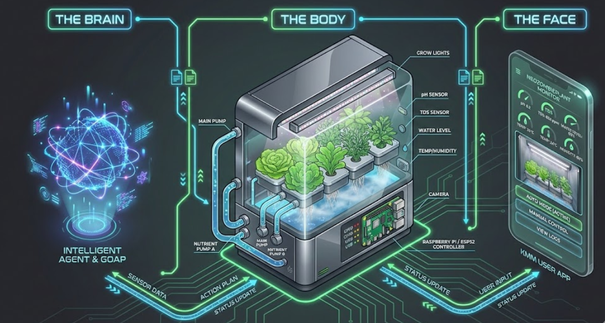

# ZombiePlant

> **Autonomous Hydroponic Intelligence**



**ZombiePlant** is an intelligent, autonomous hydroponic gardening system. It integrates hardware sensors and actuators with a sophisticated AI agent ("Zombie") to manage the complete lifecycle of a plant, from germination to harvest.

The system is designed with a **"Body-Brain-Face"** architecture:

*   **Body (Hardware)**: A Python-based controller managing pumps, lights, and sensors via a Raspberry Pi/ESP32.
*   **Brain (Agent)**: A Kotlin application using LLMs (Large Language Models) and GOAP (Goal Oriented Action Planning) to reason about plant health and schedule maintenance.
*   **Face (Frontend)**: A Kotlin Multiplatform Mobile (KMM) app for monitoring status and authorizing manual interventions.

---

## 🏗️ System Architecture

### 🧠 The Brain (Agent)
Located in the `/agent` directory.
This is the decision-making core. It runs on the local controller alongside the body.
*   **Language**: Kotlin (JVM)
*   **Logic**: Uses **GOAP** (Goal Oriented Action Planning) to dynamically plan actions based on the plant's growth stage (Seedling, Vegetative, Flowering).
*   **AI**: Integrates with LLM providers (Gemini, OpenRouter) to "reason" about sensor data and biological needs.
*   **Role**: It queries the hardware for status, decides if the plant needs water, nutrients, or light adjustments, and sends commands back to the hardware.

### 🦾 The Body (Hardware)
Located in the `/hardware` directory.
This is the physical interface interacting with the real world.
*   **Language**: Python (FastAPI, Uvicorn)
*   **Platform**: Raspberry Pi 5 / ESP32
*   **Function**:
    *   **Sensors**: Reads pH, TDS (Total Dissolved Solids), Water Level, Temperature, Humidity, and captures images.
    *   **Actuators**: Controls Peristaltic Pumps (for precise nutrient dosing), Main Water Pumps, and AC Relays (Lights/Air).
    *   **API**: Exposes a REST API (`/control`, `/sensors`) that the "Brain" talks to.

### 📱 The Face (Frontend)
Located in the `/frontend` directory.
The human interface for monitoring and control.
*   **Language**: Kotlin Multiplatform (Compose Multiplatform)
*   **Targets**: Android, iOS.
*   **Features**:
    *   View real-time sensor stats and camera feeds.
    *   Approve "Manual Mode" actions suggested by the agent.
    *   Emergency override controls.

---

## 🛠️ Hardware List

The following components were used to build the initial version of the ZombiePlant.

| Component | Description | Link |
| :--- | :--- | :--- |
| **Lights** | Horticulture Lighting Group HLG 100 V2 4000K | [Amazon](https://www.amazon.com/dp/B07C57J7XX?ref=ppx_yo2ov_dt_b_fed_asin_title&th=1) |
| **Controller** | Raspberry Pi 5 (requires flexible cable) | [Cable](https://www.amazon.com/dp/B0CVS264R1?ref=ppx_yo2ov_dt_b_fed_asin_title) |
| **Camera** | Arducam for Raspberry Pi Camera Module 3, 12MP | [Amazon](https://www.amazon.com/dp/B0C9PYCV9S?ref=ppx_yo2ov_dt_b_fed_asin_title) |
| **Wiring** | Lever Wire Connectors | [Amazon](https://www.amazon.com/dp/B0C3RSHR6S?ref=ppx_yo2ov_dt_b_fed_asin_title&th=1) |
| **Plumbing** | One Way Check Valve 5/16" | [Amazon](https://www.amazon.com/dp/B0CY1Y6HXW?ref=ppx_yo2ov_dt_b_fed_asin_title&th=1) |
| **Relay** | Iot Relay (High Power) | [Amazon](https://www.amazon.com/dp/B00WV7GMA2?ref=ppx_yo2ov_dt_b_fed_asin_title) |
| **Wire** | 20awg Wire Flexible Stranded Wire | [Amazon](https://www.amazon.com/dp/B07G2GLKMP?ref=ppx_yo2ov_dt_b_fed_asin_title&th=1) |
| **Nutrients** | General Hydroponics Flora Series | [Amazon](https://www.amazon.com/dp/B09M942WYB?ref=ppx_yo2ov_dt_b_fed_asin_title&th=1) |
| **Medium** | Natural Leca Clay Pebbles | [Amazon](https://www.amazon.com/dp/B0F244L5XY?ref=ppx_yo2ov_dt_b_fed_asin_title&th=1) |
| **Medium** | Rockwool Cubes | [Amazon](https://www.amazon.com/dp/B0FMNKQ6X8?ref=ppx_yo2ov_dt_b_fed_asin_title&th=1) |
| **Air** | Aquarium Air Pump | [Amazon](https://www.amazon.com/dp/B01EBXI7PG?ref=ppx_yo2ov_dt_b_fed_asin_title&th=1) |
| **Pots** | 3 inch Net Cups Pots | [Amazon](https://www.amazon.com/dp/B0946Q87XK?ref=ppx_yo2ov_dt_b_fed_asin_title&th=1) |
| **Prototyping** | Breadboard Jumper Wires Cable Kit | [Amazon](https://www.amazon.com/dp/B0BTT48V7P?ref=ppx_yo2ov_dt_b_fed_asin_title&th=1) |
| **Tubing** | Pure Silicone Tubing (General) | [Amazon](https://www.amazon.com/dp/B08BR4ZR4S?ref=ppx_yo2ov_dt_b_fed_asin_title&th=1) |
| **Tubing** | Pure Silicone Tubing, 6mm ID x 8mm OD | [Amazon](https://www.amazon.com/dp/B08BRCNZ46?ref=ppx_yo2ov_dt_b_fed_asin_title&th=1) |
| **Storage** | 256GB M.2 2280 NVMe SSD | [Amazon](https://www.amazon.com/dp/B0FFGXYXQV?ref=ppx_yo2ov_dt_b_fed_asin_title&th=1) |
| **Pumps** | Peristaltic Pump 12V (Dosing) | [Amazon](https://www.amazon.com/dp/B07GWJ78FN?ref=ppx_yo2ov_dt_b_fed_asin_title) |
| **Sensors** | Water Level Sensor (Non-contact/Float) | [Amazon](https://www.amazon.com/dp/B0CHRCFTKF?ref=ppx_yo2ov_dt_b_fed_asin_title) |
| **Pumps** | Water Pump 240L (Main circulation) | [Amazon](https://www.amazon.com/dp/B07X9L5RNS?ref=ppx_yo2ov_dt_b_fed_asin_title) |
| **Prototyping** | Breadboard 830 Point | [Amazon](https://www.amazon.com/dp/B01EV6LJ7G?ref=ppx_yo2ov_dt_b_fed_asin_title) |
| **Plumbing** | One Way Check Valve 1/8" | [Amazon](https://www.amazon.com/dp/B091T7MQXY?ref=ppx_yo2ov_dt_b_fed_asin_title&th=1) |

---

## 🚀 Getting Started

Follow these steps to set up the system. We'll start with the body (Hardware), then the brain (Agent), and finally the face (Frontend).

### 1. Hardware Setup (The Body)

**Prerequisites:** A Raspberry Pi 5 with Raspberry Pi OS installed.

1.  **Navigate to the hardware directory:**
    ```bash
    cd hardware
    ```
2.  **Create a virtual environment:**
    This keeps your project dependencies separate from the system.
    ```bash
    python3 -m venv venv
    ```
3.  **Activate the environment:**
    ```bash
    source venv/bin/activate
    ```
4.  **Install dependencies:**
    ```bash
    pip install -r requirements.txt
    ```
5.  **Run the Hardware API:**
    ```bash
    ./runApp.sh
    ```
    The server should now be running on `http://0.0.0.0:8000`.

### 2. Agent Setup (The Brain)

**Prerequisites:** Java Development Kit (JDK) 17 or higher.

1.  **Navigate to the agent directory:**
    ```bash
    cd agent
    ```
2.  **Configure the Agent:**
    Create a file named `local.properties` in the `agent/` folder. Add your API keys and configuration:
    ```bash
    cp local.properties.template local.properties
    # Edit the file with your keys
    ```
    Example `local.properties`:
    ```properties
    gemini.api.key=YOUR_GEMINI_API_KEY
    hydroponic.api.url=http://<IP_OF_YOUR_RASPBERRY_PI>:8000
    db.url=jdbc:postgresql://<DB_IP>:5432/zombie_plant
    ```
3.  **Run the Agent:**
    ```bash
    ./gradlew run
    ```
    Follow the on-screen prompts to select **AUTO** or **MANUAL** mode.

### 3. Frontend Setup (The Face)

**Prerequisites:** Android Studio (for Android) or Xcode (for iOS).

1.  **Navigate to the mobile app directory:**
    ```bash
    cd frontend/mobile
    ```
2.  **Build and Run (Android):**
    ```bash
    ./gradlew :composeApp:installDebug
    ```
    Or open the project in Android Studio and click "Run".

---
*Created with ❤️ by the ZombiePlant Team.*
